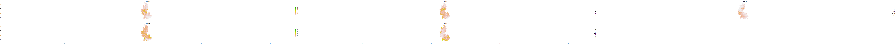

How to untar and read DWD regnie data
================
Maximilian Nölscher,
16 April 2020

For the following code chunks we need to load all required libraries

``` r
library(esmisc)
library(raster)
library(tidyverse)
```

Untar
=====

-   The DWD regnie data can be found on the [DWD ftp Server of Climate Data Center](https://opendata.dwd.de/climate_environment/CDC/grids_germany/daily/regnie/)
-   Each file is named as `daily_regnie_ra<Y>m.tar`
-   Each file itself contains 365 `ra<ymd>.gz` file, one per day.

For this example I just put 5 `.tar` files into the directory `../../raw_data/dwd_regnie_data/`

``` r
directory_tar_files <- "../../raw_data/dwd_regnie_data/"
```

First we need to untar the files. We first create a list of all files

``` r
tar_files_list <- directory_tar_files %>% list.files()
```

Show files

``` r
tar_files_list
```

    ## [1] "daily_regnie_ra1931m.tar" "daily_regnie_ra1932m.tar" "daily_regnie_ra1933m.tar" "daily_regnie_ra1934m.tar" "daily_regnie_ra1935m.tar"

We create a new folder to put in the untared files

``` r
dir.create("../../processed_data/")
dir.create("../../processed_data/dwd_regnie_data/")
```

Now we untar all files. This might take a while. For 5 `.tar` files it took approx. 30 seconds.

``` r
directory_tar_files %>% 
  paste0(tar_files_list) %>% 
  map(untar, exdir = "../../processed_data/dwd_regnie_data/")
```

Read / Import
=============

Now we can start to read in the `.gz` files

First, we list all files again.

``` r
directory_gz_files <- "../../processed_data/dwd_regnie_data/"
```

``` r
gz_files_list <- directory_gz_files %>% list.files()
```

Show files

``` r
gz_files_list %>% head()
```

    ## [1] "ra310101.gz" "ra310102.gz" "ra310103.gz" "ra310104.gz" "ra310105.gz" "ra310106.gz"

Now comes the core chunk to read in the files. I just read in the first 5 files for demonstration

``` r
first_n_files_to_read <- 1:5

raster_files <- directory_gz_files %>% 
  paste0(gz_files_list[first_n_files_to_read]) %>% 
  map(esmisc::read_regnie)
```

Now you have different options

Create Raster Stack
-------------------

``` r
raster_stack <- raster_files %>% 
  stack()
```

... and do calculations
-----------------------

e.g. create the sum

``` r
raster_stack %>% 
  calc(sum)
```

    ## class       : RasterLayer 
    ## dimensions  : 971, 611, 593281  (nrow, ncol, ncell)
    ## resolution  : 0.01663939, 0.008324751  (x, y)
    ## extent      : 5.833333, 16, 47, 55.08333  (xmin, xmax, ymin, ymax)
    ## coord. ref. : +proj=longlat +ellps=WGS84 
    ## data source : in memory
    ## names       : layer 
    ## values      : 0, 136.2  (min, max)

... or plot the raster (as stack)
---------------------------------

``` r
raster_stack %>% 
  plot
```



Reproject the CRS
-----------------

``` r
raster_files %>% 
  map(projectRaster, crs = "+init=epsg:32632")
```

    ## [[1]]
    ## class       : RasterLayer 
    ## dimensions  : 1007, 670, 674690  (nrow, ncol, ncell)
    ## resolution  : 1170, 926  (x, y)
    ## extent      : 253410.7, 1037311, 5199548, 6132030  (xmin, xmax, ymin, ymax)
    ## coord. ref. : +init=epsg:32632 +proj=utm +zone=32 +datum=WGS84 +units=m +no_defs +ellps=WGS84 +towgs84=0,0,0 
    ## data source : in memory
    ## names       : layer 
    ## values      : 0, 38.5747  (min, max)
    ## 
    ## 
    ## [[2]]
    ## class       : RasterLayer 
    ## dimensions  : 1007, 670, 674690  (nrow, ncol, ncell)
    ## resolution  : 1170, 926  (x, y)
    ## extent      : 253410.7, 1037311, 5199548, 6132030  (xmin, xmax, ymin, ymax)
    ## coord. ref. : +init=epsg:32632 +proj=utm +zone=32 +datum=WGS84 +units=m +no_defs +ellps=WGS84 +towgs84=0,0,0 
    ## data source : in memory
    ## names       : layer 
    ## values      : 0, 40.88667  (min, max)
    ## 
    ## 
    ## [[3]]
    ## class       : RasterLayer 
    ## dimensions  : 1007, 670, 674690  (nrow, ncol, ncell)
    ## resolution  : 1170, 926  (x, y)
    ## extent      : 253410.7, 1037311, 5199548, 6132030  (xmin, xmax, ymin, ymax)
    ## coord. ref. : +init=epsg:32632 +proj=utm +zone=32 +datum=WGS84 +units=m +no_defs +ellps=WGS84 +towgs84=0,0,0 
    ## data source : in memory
    ## names       : layer 
    ## values      : 0, 46.05316  (min, max)
    ## 
    ## 
    ## [[4]]
    ## class       : RasterLayer 
    ## dimensions  : 1007, 670, 674690  (nrow, ncol, ncell)
    ## resolution  : 1170, 926  (x, y)
    ## extent      : 253410.7, 1037311, 5199548, 6132030  (xmin, xmax, ymin, ymax)
    ## coord. ref. : +init=epsg:32632 +proj=utm +zone=32 +datum=WGS84 +units=m +no_defs +ellps=WGS84 +towgs84=0,0,0 
    ## data source : in memory
    ## names       : layer 
    ## values      : 0, 46.20258  (min, max)
    ## 
    ## 
    ## [[5]]
    ## class       : RasterLayer 
    ## dimensions  : 1007, 670, 674690  (nrow, ncol, ncell)
    ## resolution  : 1170, 926  (x, y)
    ## extent      : 253410.7, 1037311, 5199548, 6132030  (xmin, xmax, ymin, ymax)
    ## coord. ref. : +init=epsg:32632 +proj=utm +zone=32 +datum=WGS84 +units=m +no_defs +ellps=WGS84 +towgs84=0,0,0 
    ## data source : in memory
    ## names       : layer 
    ## values      : 0, 33.78648  (min, max)

Save as GTiff
-------------

We create a new folder to put in the `.tif` files

``` r
dir.create("../../processed_data/geotiffs/")
```

We create a vector containing the file names

``` r
tif_file_names <- gz_files_list[1:5] %>% 
  str_remove(".gz") %>% 
  str_c("../../processed_data/geotiffs/",
        .,
        ".tif")
```

We save the rasters as `.tif` files

``` r
raster_files %>% 
  map2(.x = .,
       .y = tif_file_names, 
       writeRaster, format="GTiff", overwrite=TRUE)
```

    ## [[1]]
    ## class       : RasterLayer 
    ## dimensions  : 971, 611, 593281  (nrow, ncol, ncell)
    ## resolution  : 0.01663939, 0.008324751  (x, y)
    ## extent      : 5.833333, 16, 47, 55.08333  (xmin, xmax, ymin, ymax)
    ## coord. ref. : +proj=longlat +ellps=WGS84 +no_defs 
    ## data source : C:/Noelscher.M/Projects/23_unpack_and_read_dwd_regnie_data/r/processed_data/geotiffs/ra310101.tif 
    ## names       : ra310101 
    ## values      : 0, 38.9  (min, max)
    ## 
    ## 
    ## [[2]]
    ## class       : RasterLayer 
    ## dimensions  : 971, 611, 593281  (nrow, ncol, ncell)
    ## resolution  : 0.01663939, 0.008324751  (x, y)
    ## extent      : 5.833333, 16, 47, 55.08333  (xmin, xmax, ymin, ymax)
    ## coord. ref. : +proj=longlat +ellps=WGS84 +no_defs 
    ## data source : C:/Noelscher.M/Projects/23_unpack_and_read_dwd_regnie_data/r/processed_data/geotiffs/ra310102.tif 
    ## names       : ra310102 
    ## values      : 0, 42.6  (min, max)
    ## 
    ## 
    ## [[3]]
    ## class       : RasterLayer 
    ## dimensions  : 971, 611, 593281  (nrow, ncol, ncell)
    ## resolution  : 0.01663939, 0.008324751  (x, y)
    ## extent      : 5.833333, 16, 47, 55.08333  (xmin, xmax, ymin, ymax)
    ## coord. ref. : +proj=longlat +ellps=WGS84 +no_defs 
    ## data source : C:/Noelscher.M/Projects/23_unpack_and_read_dwd_regnie_data/r/processed_data/geotiffs/ra310103.tif 
    ## names       : ra310103 
    ## values      : 0, 47  (min, max)
    ## 
    ## 
    ## [[4]]
    ## class       : RasterLayer 
    ## dimensions  : 971, 611, 593281  (nrow, ncol, ncell)
    ## resolution  : 0.01663939, 0.008324751  (x, y)
    ## extent      : 5.833333, 16, 47, 55.08333  (xmin, xmax, ymin, ymax)
    ## coord. ref. : +proj=longlat +ellps=WGS84 +no_defs 
    ## data source : C:/Noelscher.M/Projects/23_unpack_and_read_dwd_regnie_data/r/processed_data/geotiffs/ra310104.tif 
    ## names       : ra310104 
    ## values      : 0, 46.8  (min, max)
    ## 
    ## 
    ## [[5]]
    ## class       : RasterLayer 
    ## dimensions  : 971, 611, 593281  (nrow, ncol, ncell)
    ## resolution  : 0.01663939, 0.008324751  (x, y)
    ## extent      : 5.833333, 16, 47, 55.08333  (xmin, xmax, ymin, ymax)
    ## coord. ref. : +proj=longlat +ellps=WGS84 +no_defs 
    ## data source : C:/Noelscher.M/Projects/23_unpack_and_read_dwd_regnie_data/r/processed_data/geotiffs/ra310105.tif 
    ## names       : ra310105 
    ## values      : 0, 34.8  (min, max)
